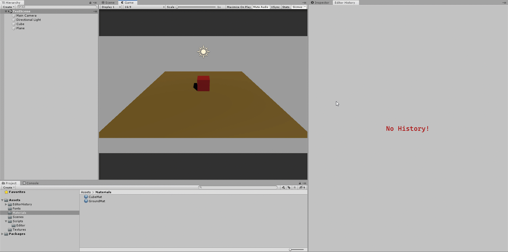

# EditorHistory
Being able to see your previous actions in Unity Editor! (Work In Progress)

* Fonts Used 
  - Cascadia Code :
    https://github.com/microsoft/cascadia-code

* EditorHistory Preview

    

Instructions:

 - Selecting any object on the scene hiearchy or the project hiearchy will add it to the history tab.
 - Left clicking on a history item will highlight it.
 - Right clicking will delete it from the history tab.
 - Mark history's element as favorite.
